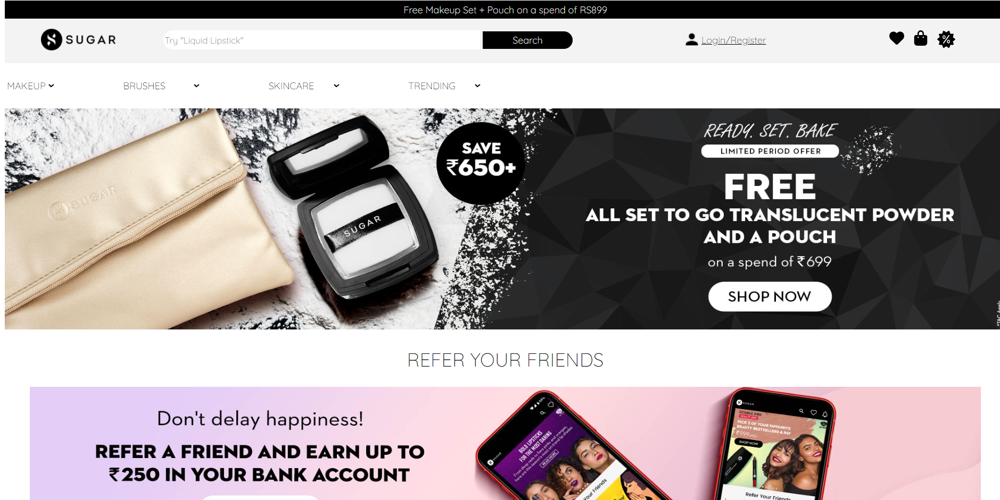
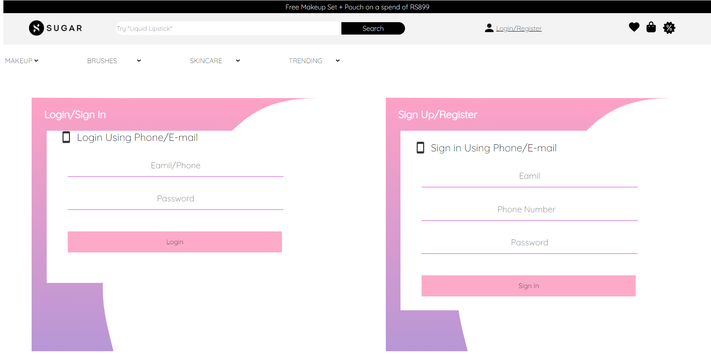
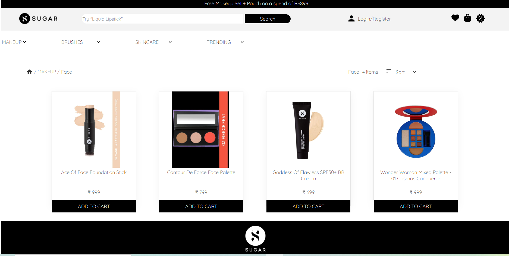
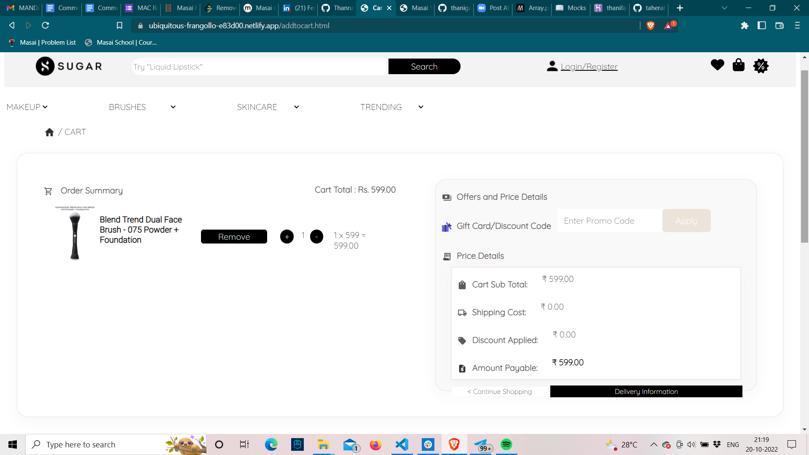
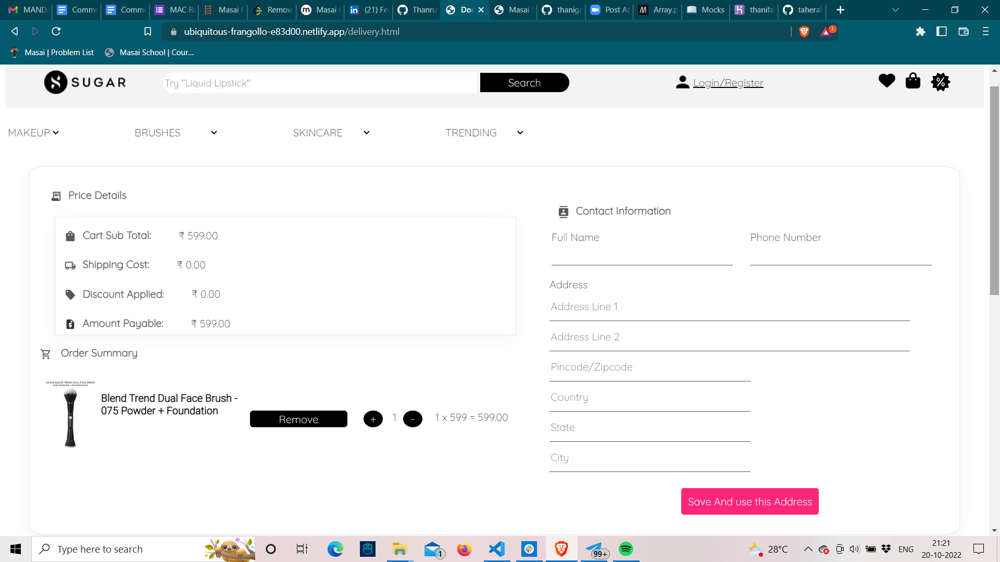

# Sugar Cosmetics Clone

This project is a clone of the [Sugarcosmetics](https://in.sugarcosmetics.com/?utm_source=google&utm_medium=search&utm_campaign=17164953316&adgroupid=136382391996&utm_content=615834222231&utm_term=sugarcosmetics) website. I cloned this website during our Unit 3 construct project week in Masai School, Bangalore.

## Deployed Site

[Sugarcosmetics clone](https://ubiquitous-frangollo-e83d00.netlify.app/)

## Presentation Video

[Presentation](https://drive.google.com/file/d/1gWjGg-inI2Jdoo8VRD6R1hiliGXf3HPB/view)

## Features

- Login / Sign-Up page with user's authentication
- Different pages for information of websites are like How it works, Use cases, Pricing, Support.
- Different pages for real time tracking software like Track, Projects, Report, Clients, Team, Help.
- Add, Update and Delete projects details.
- Handling multiple Clients and Project at the same time.
- Adding multiple teams in a project and adding multiple members in a team.

## Tech Stack

- HTML | CSS | JavaScript

## Website Sneak Peeks

### Sneak Peeks on Large Devices

- **Landing Page**

  

- **Signin and login Page**

  

- **Product Listing**

  

- **Cart Page**

  

-**Support**

- **Payment Page**

  
